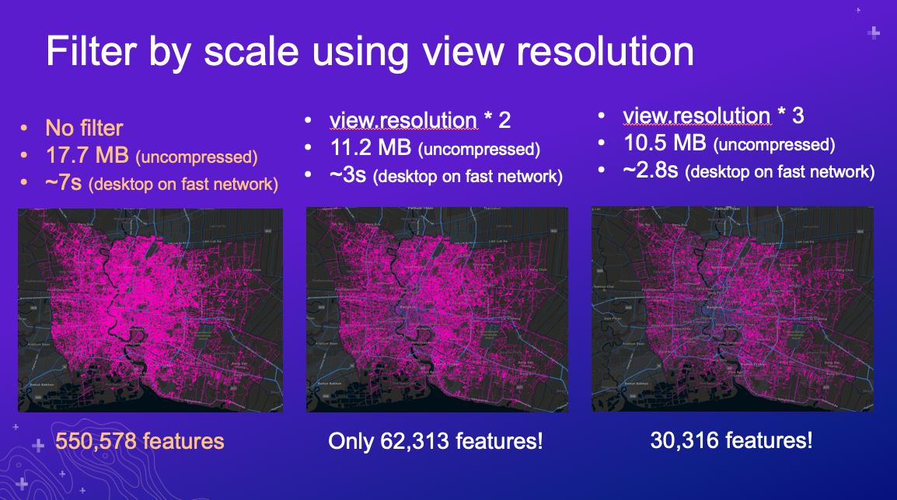

# Best Practices for Building Web Apps that Visualize Large Datasets

length: 60 min

presenters: Jeremy Bartley, Kristian Ekenes

March --, 2021 --:-- am - --:-- am PST

## Summary

Learn about the various technologies used behind the scenes by ArcGIS Online and the ArcGIS API for JavaScript that help you work with more features in the browser. We’ll demonstrate step-by-step how to optimize a large dataset for rendering and analysis in the browser starting with data preparation, feature service settings, and visualization techniques in the ArcGIS API for JavaScript that will allow your users to work with more data more efficiently in your web apps. We hope to have you walk away inspired with innovative ways to do the same in your apps.

## Presentation

[Watch](---YouTube link---) the video presentation.

## Slides

[Download slides](https://github.com/ekenes/conferences/raw/master/ds-2021/large-data/slides.pptx)

## Demos

### [Filter features by attributes](https://ekenes.github.io/conferences/ds-2021/large-data/demos/thailand-pipes/attributes.html)

This sample demonstrates how to filter features by attributes depending on the scale using a water pipes layer of Bangkok, Thailand containing more than 550,000 features. The approach involves filtering out pipes of a smaller diameter at small scales, and progressively displaying pipes with smaller diameters as the user zooms to large scales.

### [Filter features by view resolution](https://ekenes.github.io/conferences/ds-2021/large-data/demos/thailand-pipes/length.html)

This sample demonstrates how to filter features by length depending on the view resolution using a water pipes layer of Bangkok, Thailand containing more than 550,000 features. The approach involves filtering out pipes shorter than the resolution of the view multiplied by a factor (e.g. lines shorter than 2 pixels, 3 pixels, etc.). This results in maps that look visually degraded, but is one approach for aggressively reducing your total download size.

### One Ocean

This session describes the process for preparing the data used in the One Ocean app. The data started from 52 million points (4 GB) and resulted in 85,000 points with hundreds of attributes (280 MB).

[Read more about this app here](https://ekenes.github.io/conferences/ds-2021/plenary/).

## Resources

* [Community](https://developers.arcgis.com/en/javascript/jshelp/community.html)
* [ArcGIS for JavaScript API Resource Center](http://help.arcgis.com/en/webapi/javascript/arcgis/index.html)
* [ArcGIS Blog](https://www.esri.com/arcgis-blog/author/kekenes/)
* [Twitter @kekenes](http://twitter.com/kekenes)

## Licensing

Copyright 2021 Esri

Licensed under the Apache License, Version 2.0 (the "License");
you may not use this file except in compliance with the License.
You may obtain a copy of the License at

   http://www.apache.org/licenses/LICENSE-2.0

Unless required by applicable law or agreed to in writing, software
distributed under the License is distributed on an "AS IS" BASIS,
WITHOUT WARRANTIES OR CONDITIONS OF ANY KIND, either express or implied.
See the License for the specific language governing permissions and
limitations under the License.

A copy of the license is available in the repository's [license.txt](license.txt) file.