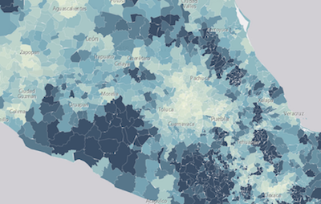
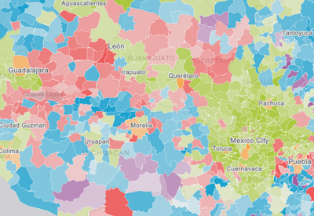
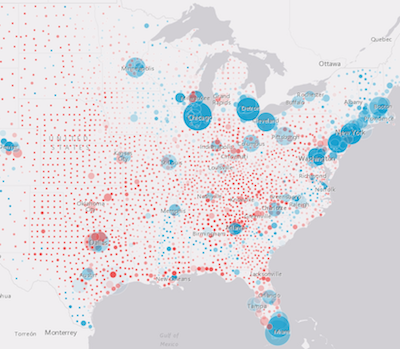

# Visualization with the ArcGIS API for JavaScript

length: 60 min

presenters: Kristian Ekenes

Feb. 12, 2020 8:30 a.m. - 9:30 a.m.

Walter E. Washington Convention Center, Room 103 A

## Summary

The ArcGIS API for JavaScript provides APIs that allow you to build powerful interactive mapping applications. Learn how you can turn your raw data into information that tells a story with 2D and 3D data-driven visualizations. This session will provide an overview to the various visualization techniques available in the ArcGIS JS API.

## Slides

[Click here to download slides](https://github.com/ekenes/conferences/raw/master/fed-2020/presentations/viz/slides.pptx)

## Demos

### Visual Variables

[Continuous size: Worldwide earthquakes](https://ekenes.github.io/conferences/ds-2019/2d-viz/demos/earthquakes/)

This sample demonstrates how to create a continuous size visualization on a point layer to visualize worldwide earthquakes by magnitude.

[Continuous color: Mexico education](https://ekenes.github.io/conferences/ds-2019/2d-viz/demos/mexico-education/)

This sample demonstrates how to create a continuous color visualization by shading fill symbols based on a numeric attribute. This app visualizes the percentage of adults in Mexico that did not participate in any formal education.

[Predominance with Arcade: Educational attainment in Mexico](https://ekenes.github.io/conferences/ds-2019/2d-viz/demos/mexico-education-predominance/)

This sample uses an Arcade expression to visualize the predominant educational attainment achieved in each municipality of Mexico. An opacity visual variable is applied to show the strength of predominance.

[Multivariate visualization: 2016 U.S. presidential election](https://ekenes.github.io/conferences/ds-2019/2d-viz/demos/multivariate-election/)

This sample demonstrates how to create a multivariate visualization using several variables related to the 2016 U.S. presidential election. The color indicates the winner (or predominant vote-getter). Opacity indicates the strength of the win. Size indicates the total number of votes cast in the county.

[Smart mapping for data exploration](https://ekenes.github.io/conferences/ds-2019/2d-viz/demos/smart-mapping/)

This sample demonstrates how to create a data exploration app using the Smart Mapping APIs. You can use the slider widgets to modify the visualization based on variables related to the 2012 election.

### Clustering

[Basic point clustering](https://developers.arcgis.com/javascript/latest/sample-code/featurereduction-cluster/index.html)

[Cluster weather stations](https://developers.arcgis.com/javascript/latest/sample-code/featurereduction-cluster-visualvariables/index.html)

[Filter clusters](https://developers.arcgis.com/javascript/latest/sample-code/featurereduction-cluster-filter/index.html)

[Filter clusters with a slider](https://developers.arcgis.com/javascript/latest/sample-code/featurereduction-cluster-filter-slider/index.html)

[Clustering - 311 calls in NYC](https://ekenes.github.io/conferences/ds-2019/2d-viz/demos/smart-mapping/)

### Dot Density

[Dot Density - Population](https://ekenes.github.io/conferences/ds-2019/plenary/dot-density-legend)

[Dot Density - Housing growth animation](https://ekenes.github.io/conferences/ds-2019/plenary/dot-density-housing)

[Dot Density Explorer](https://ekenes.github.io/esri-ts-samples/visualization/dot-density/)

[Predominance Explorer](https://ekenes.github.io/esri-ts-samples/visualization/smart-mapping/predominance/boise-housing/)

### Fast updates

[Update renderer attribute](https://developers.arcgis.com/javascript/latest/sample-code/visualization-update-data/index.html)

[Colored histogram on ColorSlider](https://developers.arcgis.com/javascript/latest/sample-code/visualization-histogram-color/index.html)

### WebStyleSymbol

[WebStyleSymbol (2D)](https://developers.arcgis.com/javascript/latest/sample-code/webstylesymbol-2d/index.html)

[WebStyleSymbol proportionally sized](https://developers.arcgis.com/javascript/latest/sample-code/webstylesymbol-proportional-2d/index.html)

## Resources

* [Community](https://developers.arcgis.com/en/javascript/jshelp/community.html)
* [ArcGIS for JavaScript API Resource Center](http://help.arcgis.com/en/webapi/javascript/arcgis/index.html)
* [ArcGIS Blog](https://www.esri.com/arcgis-blog/author/kekenes/)
* [Twitter @kekenes](http://twitter.com/kekenes)

## Issues

Find a bug or want to request a new feature?  Please let us know by submitting an issue.

## Contributing

Esri welcomes contributions from anyone and everyone. Please see our [guidelines for contributing](https://github.com/esri/contributing).

## Licensing
Copyright 2019 Esri

Licensed under the Apache License, Version 2.0 (the "License");
you may not use this file except in compliance with the License.
You may obtain a copy of the License at

   http://www.apache.org/licenses/LICENSE-2.0

Unless required by applicable law or agreed to in writing, software
distributed under the License is distributed on an "AS IS" BASIS,
WITHOUT WARRANTIES OR CONDITIONS OF ANY KIND, either express or implied.
See the License for the specific language governing permissions and
limitations under the License.

A copy of the license is available in the repository's [license.txt](license.txt) file.
