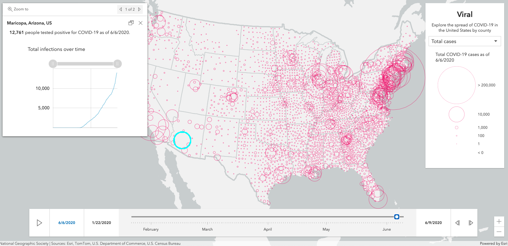
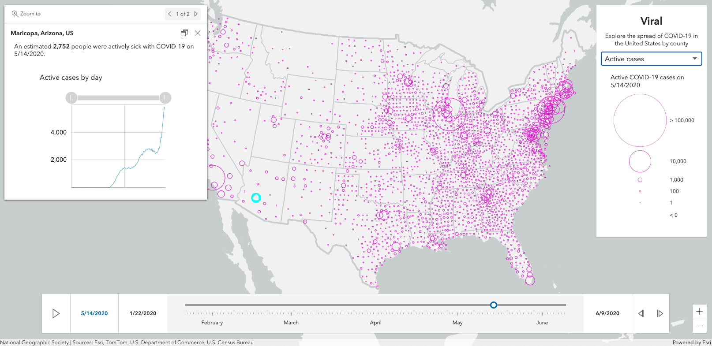
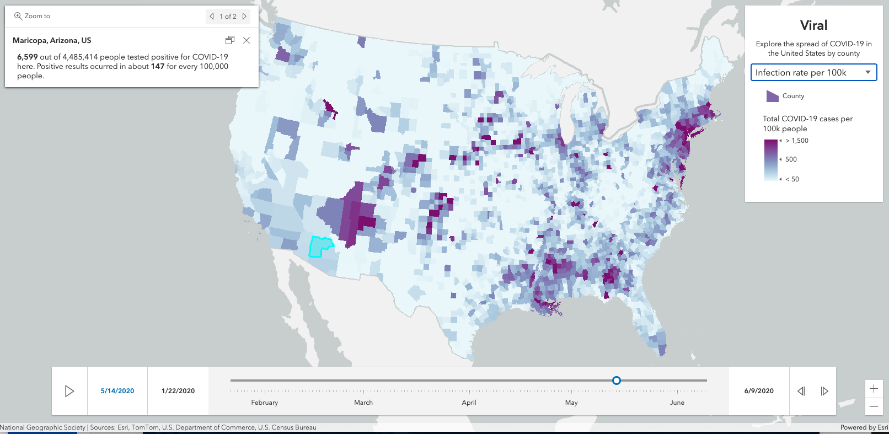

# ArcGIS API for JavaScript: 2D Visualization

length: 60 min

presenters: Kristian Ekenes, Jeremy Bartley

July 15, 2020 8:40 am - 9:40 am PDT

Streaming Live

## Summary

The ArcGIS API for JavaScript lets you build powerful interactive mapping applications. Learn how you can turn your raw data into information that tells a story with simple 2D data-driven visualizations. This session will provide an overview to the various visualization techniques available in the API specific to 2D vector data.

## Presentation

[Watch](https://www.youtube.com/watch?v=IJMhAXil9i4) the video presentation.

## Slides

[Click here to download slides](https://github.com/ekenes/conferences/raw/master/ds-2020/2d-viz/slides.pptx)

## Demos

### Viral

#### Explore COVID-19 data in the United States

The [following app](https://ekenes.github.io/covid19viz/) demonstrates how you can visualize COVID-19 data in a variety of ways using the same dataset. Use the time slider to explore this data through time. Each time the slider moves, the layer's renderer and popups update based on newly generated [Arcade expressions](https://developers.arcgis.com/arcade/).

##### Total Cases

##### Doubling Time

##### Active Cases

##### Active Rate

##### Infection rate

##### Total deaths

##### Death rate

## Resources

* [Community](https://developers.arcgis.com/en/javascript/jshelp/community.html)
* [ArcGIS for JavaScript API Resource Center](http://help.arcgis.com/en/webapi/javascript/arcgis/index.html)
* [ArcGIS Blog](https://www.esri.com/arcgis-blog/author/kekenes/)
* [Twitter @kekenes](http://twitter.com/kekenes)

## Licensing

Copyright 2020 Esri

Licensed under the Apache License, Version 2.0 (the "License");
you may not use this file except in compliance with the License.
You may obtain a copy of the License at

   http://www.apache.org/licenses/LICENSE-2.0

Unless required by applicable law or agreed to in writing, software
distributed under the License is distributed on an "AS IS" BASIS,
WITHOUT WARRANTIES OR CONDITIONS OF ANY KIND, either express or implied.
See the License for the specific language governing permissions and
limitations under the License.

A copy of the license is available in the repository's [license.txt](license.txt) file.